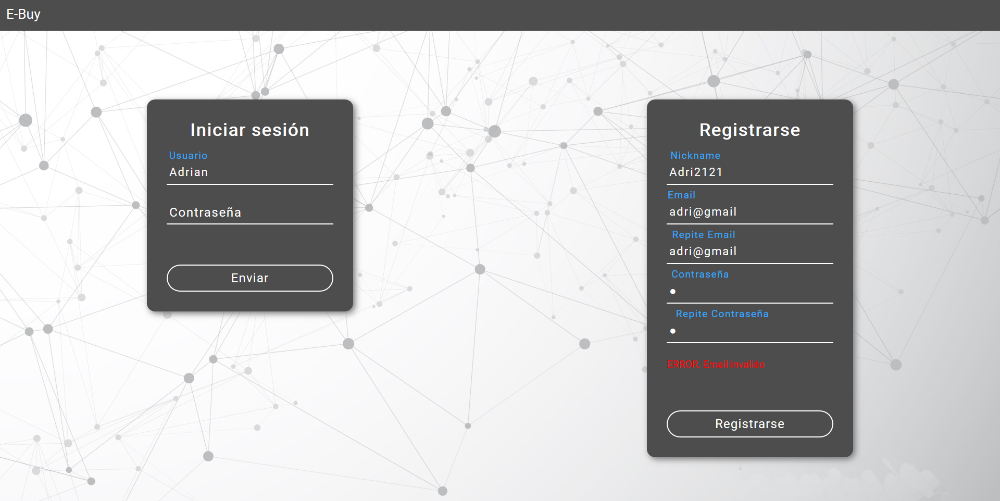
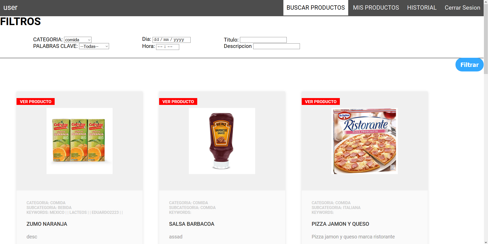
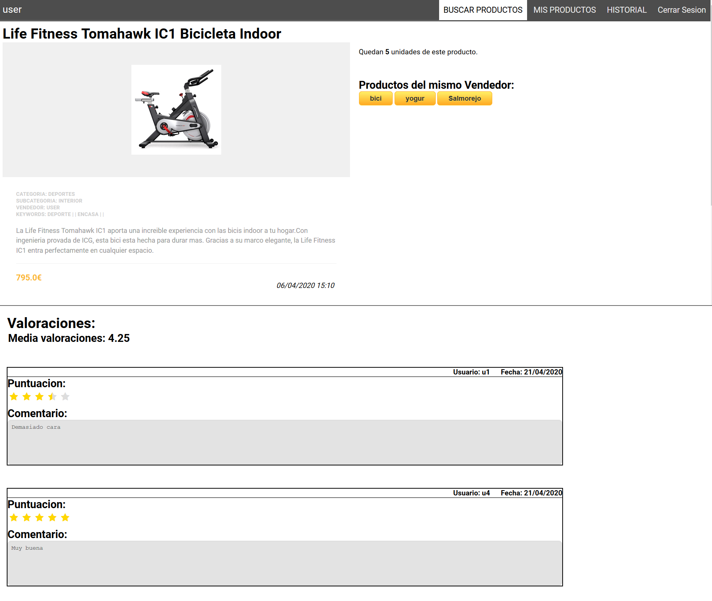
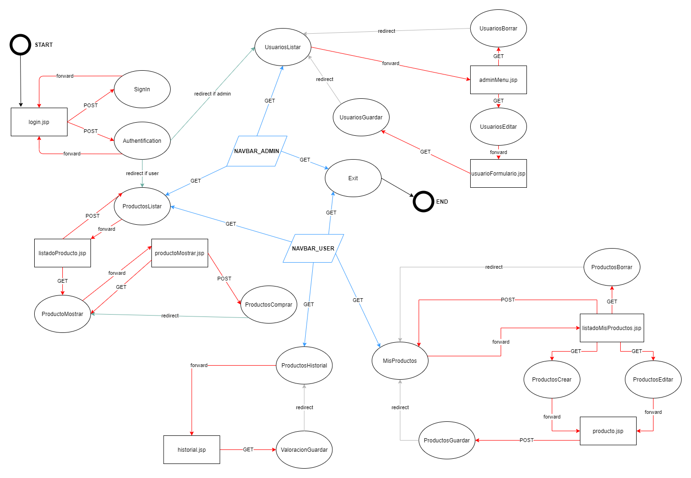

# Ebuy - Java EE (JSP/Servlets)
Web-App developed by:
* Adrian Salas
* Alberto Romero
* Alicia Tabachi
* Victoria Caracuel

## Preview of the app

## Flow Chart

## Build

The app was developed in Netbeans IDE 8.2 using JavaDB as database and Glassfish 4.1.1 as server (it also works on Glassfish 5.0 with a tweak on the `src/java/ebuy/entity` classes)
Create a database called ebuy in your JavaDB server and run the script `ebuydb.sql`.
Clean, build and run the project, and your app will be on `localhost:8080/Ebuy`
